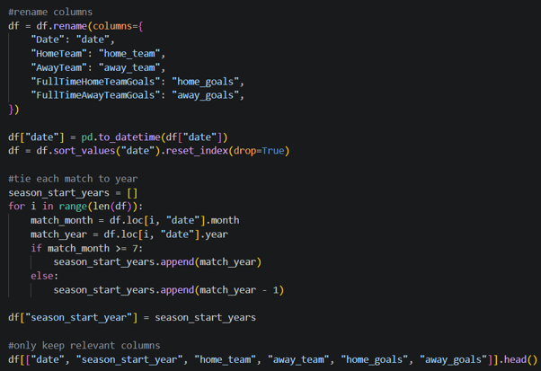
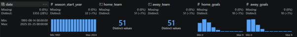
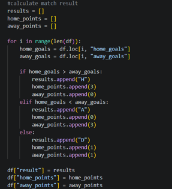
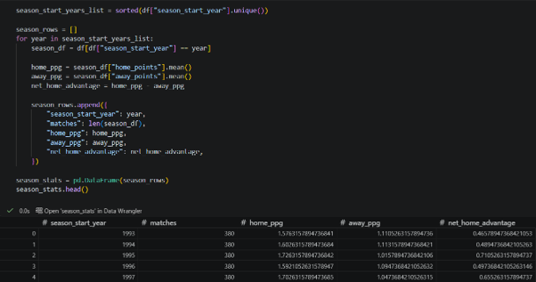
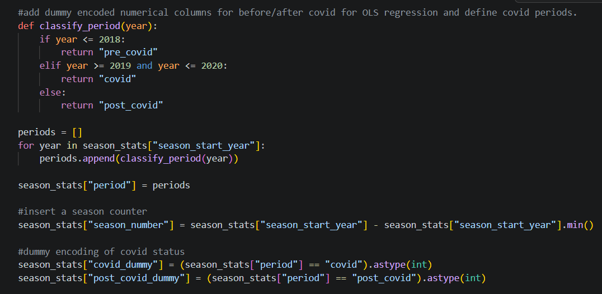
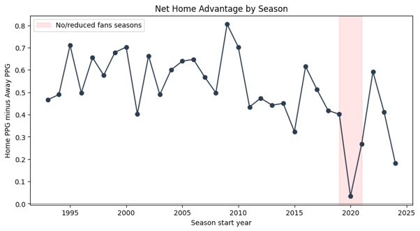
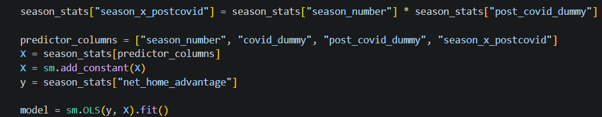
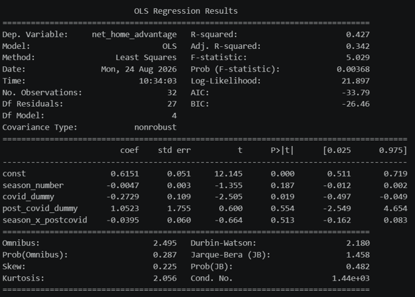
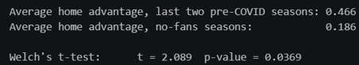

# Premier League Home Advantage: The Impact of COVID-19 (1993–2025)

## Introduction and Executive Summary

Home advantage within Association Football is a well-documented phenomenon where a team
has improved form and wins more games when playing at their home stadium in front of
their own fans (Pollard, 2008; Wunderlich et al., 2021). There are also several
documented reasons for what can influence home advantage within football: tactics,
injuries, referee bias, or other psychological factors (Pollard, 2008).

This project assesses the trend of home advantage across over 12,000 Premier League
matches between the 1993/94 and 2024/25 seasons, and aims to measure the impact before,
during, and after the COVID-19 pandemic (COVID), which resulted in numerous matches
being played with reduced or zero fans present between 2019 and 2021.

Findings from this report show that there was no significant trend in home advantage
before COVID, with a small season-by-season coefficient (-0.0047 points per game (PPG))
demonstrating that home advantage was reasonably stable prior to COVID. The periods
identified without fans, however, saw a significant reduction in home advantage: home
team PPG fell by 0.27 compared to the pre-COVID prediction, a statistically significant
result (p = 0.019). This signifies that the absence of fans had a measurable impact on
home advantage, which supports other academic literature such as McCarrick et al.
(2021), who found that home teams produced significantly fewer attacking opportunities,
scored fewer goals, and gained fewer points across 15 different leagues in 11 different
countries across Europe during COVID.

## Data Infrastructure and Tools

The raw dataset for this report is a single CSV file with a row for each fixture, goals
for and against, along with time and date information. With over 12,000 fixtures to
process, Python was chosen as the most suitable tool for this project, given its wide
array of packages and libraries available for regression analysis, as well as its
capability for cleansing and transforming large datasets.

This project used the following Python libraries within a Jupyter Notebook:

- **Pandas** – data loading and transformation
- **NumPy** – mathematical functions
- **Statsmodels** – regression models, statistical tests, and time series functions
- **SciPy** – t-tests and robustness checks
- **Matplotlib** – plots and visualisations

Due to the CSV file containing information dating back to 1993, loading the file through
Pandas returned an encoding error, as part of the file was not encoded using standard
UTF-8. This required an additional step within the loading process to attempt several
encoding types in turn (`utf-8`, `cp1252`, `latin1`).

The dataset used within this report was sourced from Kaggle in CSV format. *https://www.kaggle.com/datasets/ajaxianazarenka/premier-league/data?select=PremierLeague.csv*

## Data Engineering

The raw data required several steps of transformation before it could be applied to a
regression model.

The first stage was to derive the season each match belonged to. As the Premier League
runs between August and May, games belonging to one season are split across two calendar
years, meaning that processing a time series against calendar year alone would remove
the seasonal structure of the competition. To address this, each match was assigned a
`season_start_year`. Figure 1 shows how this was processed, along with additional steps
for renaming column headers and excluding columns no longer required.

   
  <em>Figure 1 - Assigning Season Start and Additional Transformation Steps</em>

With the `season_start_year` column created and only relevant columns retained, the
dataset was inspected for quality using a Visual Studio Code extension called Data
Wrangler, which allows a Pandas DataFrame to be viewed as a table alongside column-level
quality statistics, shown in Figure 2.

   
  <em>Figure 2 - Column Quality Assurance</em>

This tool highlights missing values as well as outliers, such as incorrect years or
unrealistic goal tallies. As this dataset is publicly sourced from a well-established
organisation, the data was expected to be of reasonably high quality, though it remains
good practice to quality-assure any dataset used in analysis.

As Points Per Game (PPG) is the primary metric used within the regression, match result
and points needed to be calculated. Figure 3 demonstrates the process of assigning the
match result based on home and away goals, and then assigning points based on that
result.

   
  <em>Figure 3 - Result and Points Calculation</em>

With results and points calculated for each fixture, the data was aggregated by season,
taking the mean home and away PPG, with the difference between the two defined as net
home advantage. Figure 4 demonstrates this process and its outcome.

   
  <em>Figure 4 - Aggregation of Fixtures into Seasons</em>

As the project's aim is to assess how COVID impacted home advantage, each season was
also assigned a COVID status: pre-COVID, during COVID, or post-COVID. The 2019 and 2020
seasons were identified as the COVID seasons, since these two seasons featured matches
played with zero or reduced fans. Fans did not fully return to stadiums until the start
of the 2021 season.

Figure 5 shows how each season was assigned its COVID status, along with additional
dummy-encoded columns for that status to be used in the regression model — required
because regression cannot be applied to text and must instead have numerical inputs.

   
  <em>Figure 5 - Addition of COVID Status and Encoding</em>

## Data Analysis

With seasonal PPG and COVID status calculated and assigned, the trend of home advantage
was plotted over time, shown in Figure 6.

   
  <em>Figure 6 - Trend of Home Advantage by Year</em>

As pictured, there is significant variance in home advantage by season, with no clearly
defined trend overall. The seasons highlighted in red are the identified COVID seasons,
and there is a clear drop in home advantage during this period, with the 2020 season
nearly reaching zero — indicating that COVID, and the resulting lack of fans in
attendance, affected the strength of home advantage.

To measure this impact, the data was applied to an Ordinary Least Squares (OLS)
regression model using segmented regression. Segmented regression using OLS is one of
the most recommended techniques for determining whether a specific event (in this case,
COVID) changes an existing trend (Wagner et al., 2002).

This regression model uses four independent variables — `season_number`, `covid_dummy`
(seasons during COVID), `post_covid_dummy` (seasons post-COVID), and
`season_x_postcovid` (the post-COVID trend's slope) — to explain the dependent variable,
`net_home_advantage`.

Figure 7 shows the Python code used to build the model, and Figure 8 shows the
regression output.

   
  <em>Figure 7 - OLS Regression Model</em>

   
  <em>Figure 8 - OLS Regression Results</em>

As shown, the regression model returned an R² of 0.427 and an adjusted R² of 0.342 (the
adjusted figure accounts for the number of predictors), suggesting that around 34% of
the variance within the data is explained by the model. While an adjusted R² of 0.342
may appear low at first glance, for a social science outcome with significant
day-to-day variance — refereeing decisions, injuries, changes in management — this
metric can be considered reasonable (Minsa, 2026).

**`season_number`** returned a small negative coefficient of -0.0047 (p = 0.187, not
significant), suggesting there was no gradual decline in home advantage prior to COVID.

**`covid_dummy`** returned a negative coefficient of -0.2729 (p = 0.019, significant),
meaning the null hypothesis can be rejected. From this, it can be determined that fans
being present is a significant factor in driving home advantage — a finding supported by
McCarrick et al. (2021), who also identified crowds as a significant factor among
several others.

**`post_covid_dummy`** returned a coefficient of 1.0523, indicating a sharp uptick in
home advantage immediately after COVID. However, with p = 0.554, this result is not
statistically significant, and with only three seasons of post-COVID data, the model
cannot reliably distinguish a genuine pattern from noise in the data.

**`season_x_postcovid`** returned a negative coefficient of -0.0395, indicating a
declining slope in home advantage across the post-COVID seasons. This is similarly
caveated by the small post-COVID sample size relative to the variance seen in prior
seasons, and is reflected in its own non-significant p-value of 0.513.

In addition to the season-level regression, a t-test was carried out on match-level
data, comparing average home advantage in the two pre-COVID seasons immediately prior
(2017 and 2018) against the COVID seasons (2019 and 2020).

   
  <em>Figure 9 - T-test Results</em>

As shown in Figure 9, there is a marked drop in average home advantage (the difference
between home PPG and away PPG). A p-value below 0.05 means the null hypothesis of no
change in mean home advantage can also be rejected here, further supporting the
statistical significance of fan presence.

## Conclusion

This report found a clear relationship between home advantage and the presence of fans
in stadiums, which was interrupted by COVID. This is supported by extensive academic
literature that has also studied this phenomenon (Fischer and Haucap, 2021; McCarrick et
al., 2021; Wunderlich et al., 2021).

While this report reinforces the existing literature on COVID's effects, it also found
no measurable downward or upward trend in home advantage in the Premier League prior to
COVID.

While COVID is one of the most impactful events affecting home advantage, several other
factors also play a role. Pollard (2008) found that travel, refereeing bias, territory,
and various other psychological factors all influence match outcomes.

This report contains no personal or private information, and all data used is publicly
available. There are therefore no concerns or adjustments required relative to the
General Data Protection Regulation, nor any ethical impacts or considerations to note.

## References

Fischer, K. and Haucap, J. (2021) ‘Does Crowd Support Drive the Home Advantage in Professional Football? Evidence from German Ghost Games during the COVID-19 Pandemic’, Journal of Sports Economics, 22(8), pp. 982–1008. Available at: https://doi.org/10.1177/15270025211026552.
McCarrick, D. et al. (2021) ‘Home advantage during the COVID-19 pandemic: Analyses of European football leagues’, Psychology of Sport and Exercise, 56. Available at: https://doi.org/10.1016/j.psychsport.2021.102013.
Minsa A (2026) Interpreting R Squared. Available at: https://statisticsfundamentals.com/simple-linear-regression/r-squared/#interpretation (Accessed: 24 August 2026).
Pollard, R. (2008) ‘Home Advantage in Football: A Current Review of an Unsolved Puzzle’, The Open Sports Sciences Journal, 1(1), pp. 12–14. Available at: https://doi.org/10.2174/1875399X00801010012.
Wagner, A.K. et al. (2002) Segmented regression analysis of interrupted time series studies in medication use research.
Wunderlich, F. et al. (2021) ‘How does spectator presence affect football? Home advantage remains in European top-class football matches played without spectators during the COVID-19 pandemic’, PLOS ONE, 16(3), p. e0248590. Available at: https://doi.org/10.1371/journal.pone.0248590.
